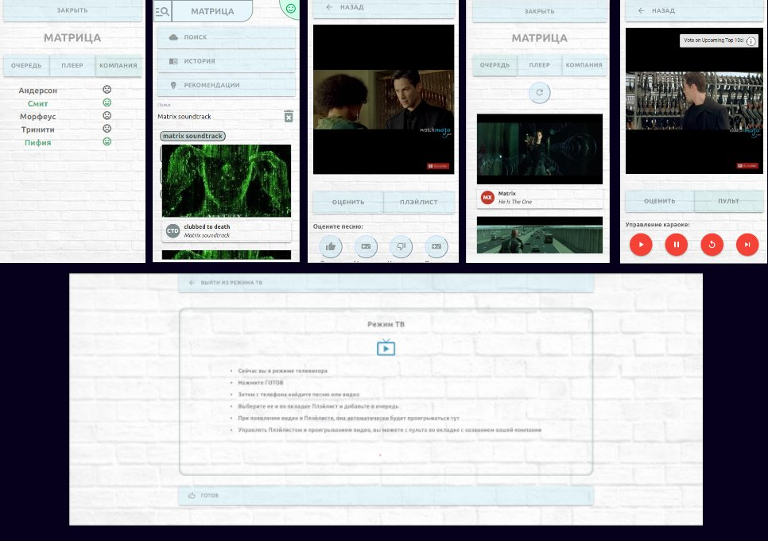

# Garage-canzoni

### Примечание: 
Это копия моего пет-проекта с Gitlab.

Из-за бесплатности всех сервисов
и ограничений, связанных с этим, сделать консистентные `dev`/ `prod` среды
не представляется возможным (по временным затратам для одного разработчика `;-)`)

Dev и prod смотрят
на одни и те же внешние сервисы, т.е в настройках есть конфиденциальные
данные, которые я не хотел бы отправлять в общий доступ.

Поэтому запустить `dev`, без секретных настроек, не удастся,
но можно посмотреть `prod` проекта
на https://garage-canzoni.vercel.app

### Описание проекта
App используется, как пульт управления от ТВ, для посиделок в компании
друзей.

Как источник музыки или видеороликов используется Youtube.

Теперь каждый может добавить в очередь свое видео/музыку,
не толпится у ~PС, споря о том, что "точно стоит" посмотреть.
Как и сразу переключить видео, если друзья не оценили контент

Под каждую компанию или для себя можно создать отдельную группу.

Возможности:
* Просмотр видео/музыки без рекламы
* Возможность добавлять в общий плейлист музыку или видео
* Пульт управления плэйлистом и контентом у всех участников
* Создание различных групп для разных компаний или 
для частного пользования.
* Прочее

### Пример работы App:

### Технологии:
MERN stack, TS, Jwt, Redux toolkit, SSE

DEV: Docker-compose

### CI/CD:

* Api: Gitlab. ( https://canzoni-garage-api.herokuapp.com )

* Client: Vercel. ( https://garage-canzoni.vercel.app )
